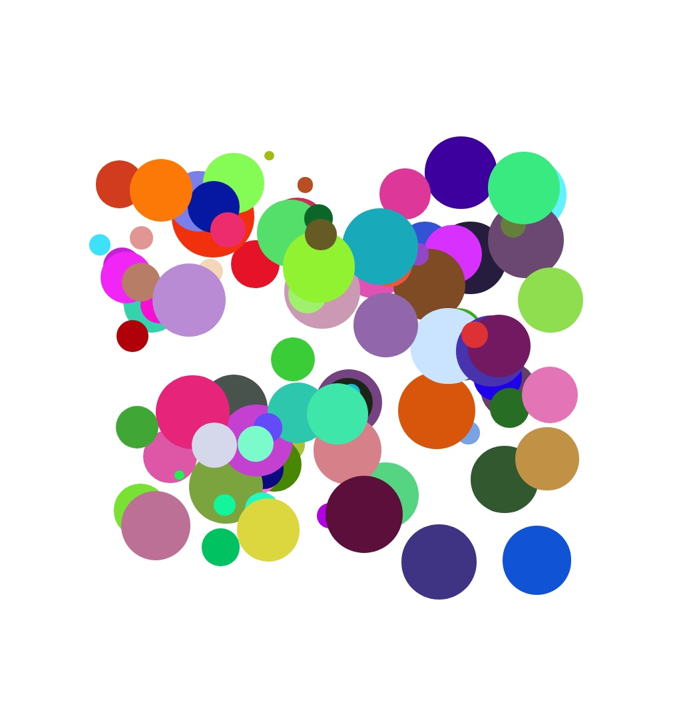

# reactish circle challenge

ok, here's a little challenge for you: react without react!
or, at least, one aspect of react.
that is, creating web pages using javascript.

see if you can take the supplied functions and create a picture that looks like this:

you'll want to get a reference from the dom to the root div on the index.html, create the circles using the supplied functions
and then append them to the root div using array.map

there are several branches you can check out if you want some hints or the final answer.  
the first one is the start, the second is a halfway point and the third is the final answer!

good luck, i hope it's a little bit fun.
